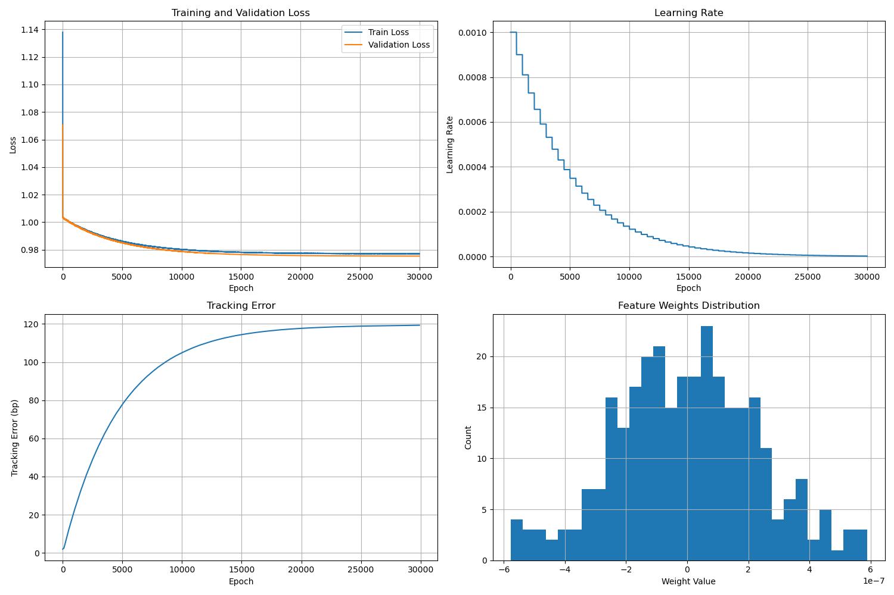

# 功能：使用lasso regression方法对于沪深300指数进行不完全复制，选取最高的n只股票进行拟合

## 1. 特点
### 1.1 拟合方法：lasso regression                            
### 1.2 框架：pytorch，sklearn
### 1.3 封装API：不完全复制的股票个数top_n_stocks可任意调控，其他超参数已封装到参数网格中，一键进行多组参数的调试

```python 
param_grid = {
        'learning_rate': [0.001,0.01,0.1], 
        'l1_lambda': [0.1,1],
        'batch_size': [64,128],  
        'patience': [100,300],     
        'step_size': [500],     
        'gamma': [0.9]    
    }，
```

## 2.工作区目录
```
|————workspace                                                                                                                       
     |————data
          |————300628_20220101_20241031.csv        #指数成分股的时间序列数据群
          |————000100_20220101_20241031.csv
          |————......
     |————code
          |————get_stockbase.py        #获得股票数据
          |————main2.py                #主文件                            
     |————results
          |————images         
               |————training_process_lr1.7970102999144342e-06_l1_0.1_batch_30000_patience_100_20241118_102702        #参数搜索网络中某一组合对应的训练可视化图
               |————...... 
          |————training——result.csv    #各参数组合下训练结果记录                   
      
```

## 2. 使用方法：
### 2.1 使用code/stockbase爬取【指数成分股列表】，【股指价格的时间序列数据】，【研究时间区间内的成分股价格数据】

### 2.2 使用main2.py文件对于指数数据进行回归，修改if __name__ == "__main__"后的基础参数base_params和参数搜索网格param_grid


### 2.3 根据第`3`部分的结果呈现进行分析 

## 3. 结果表现   
### 3.1 训练完毕后会生成梯度下降曲线，跟踪误差，学习率下降曲线和特征分布柱状图，自动保存在工作目录下的result目录下，可以很直观的查看各种参数组合的训练效果

### 3.2 使用参数搜索网络传入多组训练参数时，在训练完毕后，可以自动生成对应参数和拟合结构的csv文件(自动按照跟踪误差降序排列)，写入方法为查重后新增，构建结果数据库
[实例参数组合与拟合结果的组合数据库](results/training_results.csv) 
### 3.3 训练时会生成epoch，total_loss,val_loss和lr的log文件        
